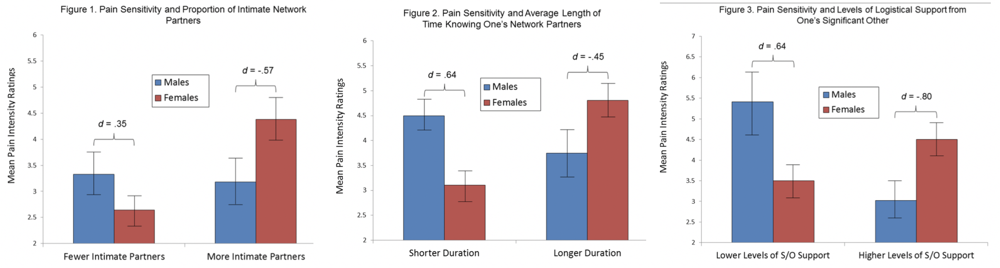

# PUI2018_HW5
## Author: Chang Du

## Assignment 1
Create a pull request to provide some suggestions on my classmate Rufei Sheng(rs6431)'s Citibike project assignment. The pull request contains a readme2.md. In this markdown profile, I provide some advice on code, statistical test method in the next step, and suggestions to improve variables.

https://github.com/Rufei-Sheng/PUI2018_rs6431/blob/master/HW4_rs6431/README2.md

## Assignment 2: Group Work: Literature choices of statistical tests

Worked with Mingyi He(mh5172) and Xiaoning He(xh1163). I finished the Correlation part.

| **Statistical Analyses**  |  **IV(s)**  |  **IV type(s)** |  **DV(s)**  |  **DV type(s)**  |  **Control Var** | **Control Var type**  | **Question to be answered** | **_H0_** | **alpha** | **link to paper**|
|:----------:|:----------|:------------|:-------------|:-------------|:------------|:------------- |:------------------|:----:|:-------:|:-------|
ANCOVA  | 4, gender, proportion of intimate partners,length of time knowning their partners,levels of support from parters  |  categorical  | 1, Pain sensitivity rating| ordinal | 1, age | continuous |   how individuals’ social networks moderate the association between biological sex and experimental pain sensitivity. | Difference between F_pain and M_pain ( when more partners, longer relationship and higher support) = Difference between F_pain and M_pain(when fewer partners, shorter relationship and lower support)  | 0.05 | [Sex Differences in How Social Networks and Relationship Quality Influence Experimental Pain Sensitivity](https://journals.plos.org/plosone/article?id=10.1371/journal.pone.0078663) |
  |||||||||

The main plots of the paper (the plots that summarized the result)

| **Statistical Analyses**  |  **IV(s)**  |  **IV type(s)** |  **DV(s)**  |  **DV type(s)**  |  **Control Var** | **Control Var type**  | **Question to be answered** | **_H0_** | **alpha** | **link to paper**|
|:----------:|:----------|:------------|:-------------|:-------------|:------------|:------------- |:------------------|:----:|:-------:|:-------|
Correlation | 7, age, gender, self-reported honesty, self-reported popularity, self-reported intelligence, class level, block | categorical | 1, cheating behaviors | ordinal | 1, test difficulty | ordinal | How strongly and in what direction are demographics (age, gender), self-perception(self-reported honesty, self-reported popularity, self-reported intelligence), environmental factors(class level, block) related with cheating behavior. | Depends on which IV is tested: take gender for example: (women's score of experimental group/ women's score of control group) > (men's score of experimental group/ men's score of control group) | 0.05 | [Behavioral correlates of cheating: Environmental specificity and reward expectation](https://journals.plos.org/plosone/article?id=10.1371/journal.pone.0186054) |

The main plots of the paper (the plots that summarized the result)

| **Statistical Analyses**  |  **IV(s)**  |  **IV type(s)** |  **DV(s)**  |  **DV type(s)**  |  **Control Var** | **Control Var type**  | **Question to be answered** | **_H0_** | **alpha** | **link to paper**|
|:----------:|:----------|:------------|:-------------|:-------------|:------------|:------------- |:------------------|:----:|:-------:|:-------|
Logistic Regression | 7, Number of tubes | categorical | 84, combination of features | continuous | 5, fluorescence markers | categorical | How flow cytometry measurements from a single patient and gives a confidence score of the patient being AML-positive.| patient being AML-positive | 0.05 | [Leukemia Prediction Using Sparse Logistic Regression](https://journals.plos.org/plosone/article?id=10.1371/journal.pone.0072932)

The main plots of the paper (the plots that summarized the result)

## Assignment 3: Reproduce the analysis of the Hard to Employ program in NY
By Hypothesis testing, I figured out whether the program has influence on participants' employment and the percentage of being convicted of a felony in the Recidivism (Years 1-3) after release. The method including Z-test and Chi-Sqaure test.

https://github.com/Chang-Du/PUI2018_cd2682/blob/master/HW5_cd2682/HW5_Assignment3_cd2682.ipynb

## Assignment 4: Tests of correlation using the scipy package with citibike data.
I choose 201501 and 201506 two different seasons dataset of citi-bike riding.
I use three kinds of tests (Pearson’s test, Spearman’s test, K-S test) to figure out whether there are statistical differences between the trip duration of daytime riding and nighttime riding. For the KS test, there are two parts of test: 1) with the entire dataset 2) with the 200 times smaller sub-dataset. For Pearson’s test and Spearman’s test, set two same size of sub-dataset of the trip duration of daytime riding and nighttime riding is required.

https://github.com/Chang-Du/PUI2018_cd2682/blob/master/HW5_cd2682/HW5_Assignment4_cd2682.ipynb