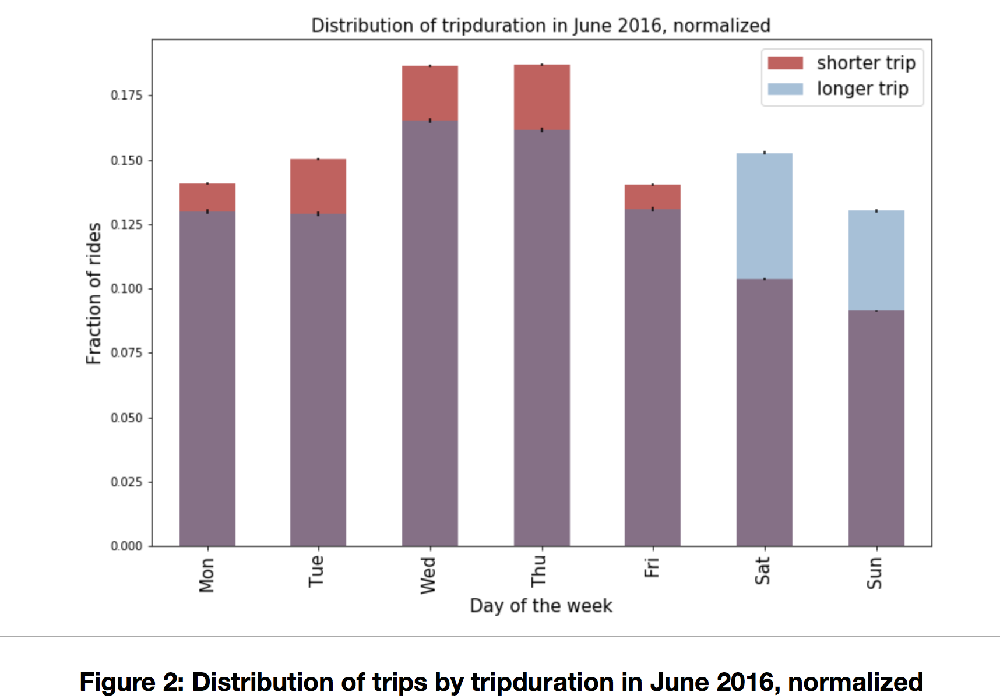

__Chang Du’s plot review by Timur Mukhtarov__

CLARITY: The plot took me some time to understand. What made it confusing is that there are 3 colors in the bar chart, while the legend only states too. The caption addresses it, but I would suggest changing the legend to have 3 colors. Another thing that I found confusing was the y-axis. Since it is labeled “Fraction”, I expect the values of axis to represent percentages and values in the graph to add to 1 (or 100 %), which does not happen.

ESTHETIC: I think that bar chart is a good idea, although I find it hard to compare shorter trips fractions day-over-day. 

HONESTY: I think the graph conveys information honestly. It shows that shorter trips are more popular on weekdays while longer trips are more popular on weekends. However, it is unclear what defines trip length to be short or long. In a way, this graph leaves it up to the reader to rely on their judgement, which should be avoided.

